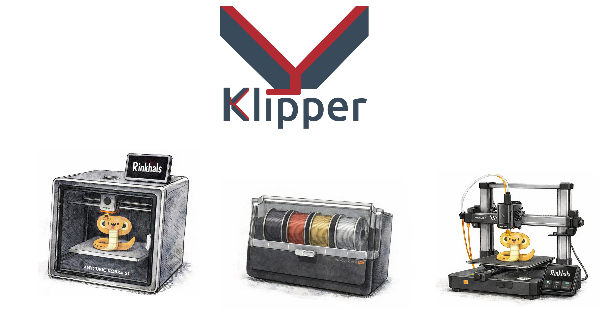

# Vanilla Klipper and Tunneled-Klipper APPs development builds

  

This repository contains experimental test builds of:

- **[Vanilla-Klipper](vanilla-klipper.md)** → Run Klipper natively on the Anycubic Kobra S1 and K3 series SoC under Rinkhals. Vanilla-klipper app now includes the **[ACEPro driver](https://github.com/Kobra-S1/ACEPRO/tree/dev)** for multi-color/multi-material support.
- **[Tunneled-Klipper](tunneled-klipper.md)** → Instead of running Klipper on the printer SoC, it forwards serial comms over USB gadget mode to a Raspberry Pi 4.

---

## ⚠️ General Notes
- You need to have Rinkhals installed on your Anycubic Kobra S1 and Kobra 3 / 3V2, as this is the host starting these APPs
- These builds are fairly stable but also still **experimental**.  
- Some hardware features may not work or may only function when combined with tunneled-klipper + RPi4 (e.g., LIS2DW12 resonance testing).  
- Currently only **Mainsail Web Interface** is supported (UI control via Anycubic UI on the display with vanilla-klipper is very limited). I recommend installing KlipperScreen with a dedicated LCD display for ease of use.

👉 Choose your setup:

- If you want Klipper directly on the printer → [**vanilla-klipper.md**](vanilla-klipper.md)  
- If you want to offload Klipper to an external RPi4 → [**tunneled-klipper.md**](tunneled-klipper.md)  

For discussion, see the Rinkhals Discord:
- **[#vanilla-klipper channel](https://discordapp.com/channels/1332498592539345069/1344072676477632543)**
- **[#tunneled-klipper thread](https://discordapp.com/channels/1332498592539345069/1394019705613975712)**

---

## 📚 Quick Links & Resources

### 🔧 Base System
- **[Rinkhals](https://github.com/jbatonnet/Rinkhals)** - Open-source firmware extension for Klipper-Go based Anycubic printers

### 🎨 ACE Pro Multi-Color Support
- **[ACE Pro Klipper Driver](https://github.com/Kobra-S1/ACEPRO/tree/dev)** - Klipper driver to add support for Anycubic Color Engine Pro units on Anycubic Kobra S1/K3 printers

### 📖 Installation & Setup Guides
- **[Klipper Installation on RPi](klipper_install.md)** - Step-by-step guide for installing Klipper on Raspberry Pi using KIAUH
- **[Tunnel Setup Guide](SetupRaspberryPiTunnel.md)** - Configure Raspberry Pi tunnel for tunneled-klipper setup
- **[Vanilla Klipper Setup](vanilla-klipper.md)** - Detailed vanilla-klipper installation and configuration
- **[Tunneled Klipper Setup](tunneled-klipper.md)** - Detailed tunneled-klipper installation and configuration

### 🛠️ Utilities & Scripts 
- **[Tunnel Control Script](tunnel_control.sh)** - Manage LED and Tunnel App from Raspberry Pi 
- **[Setup Tunnel Script](setup_tunnel_klipper.sh)** - Automated tunnel setup for RPi

### 📦 Downloads
- **[Releases](releases/)** - Latest Klipper app builds for Rinkhals (.swu files)

---

## 👏 Credits & Contributors

**Special Thanks to [@jbatonnet](https://github.com/jbatonnet)** for creating the [Rinkhals](https://github.com/jbatonnet/Rinkhals) project - the foundation that makes this applications possible.

Thanks to the following contributors for their work on documentation, installation scripts, automatisation, Klipper configuration and testing:

- **[moosbewohner](https://github.com/moosbewohner)**
- **[m4d53](https://github.com/m4d53)**
- **[NUKY](https://github.com/xNuky)**
- **[Gewbster](https://github.com/Gewbster)**

This project builds upon the excellent work of the Rinkhals and Klipper communities.
