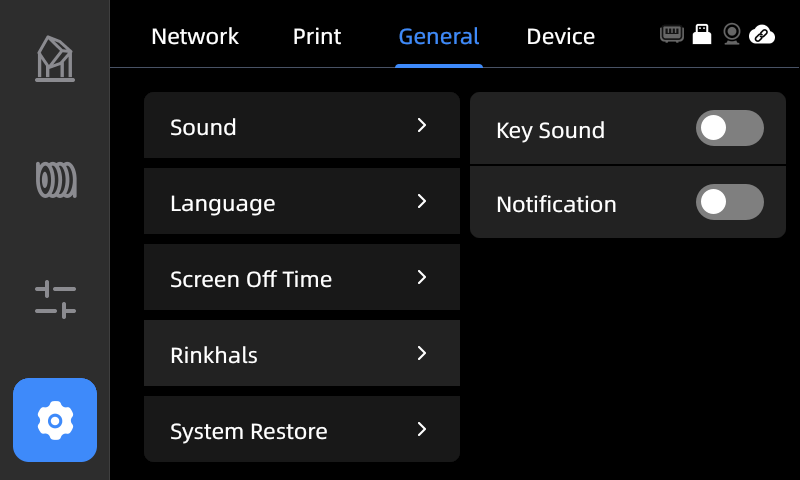
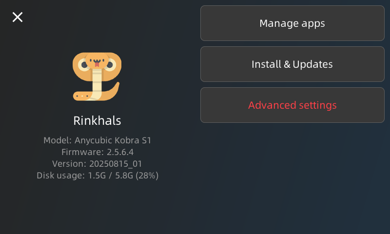
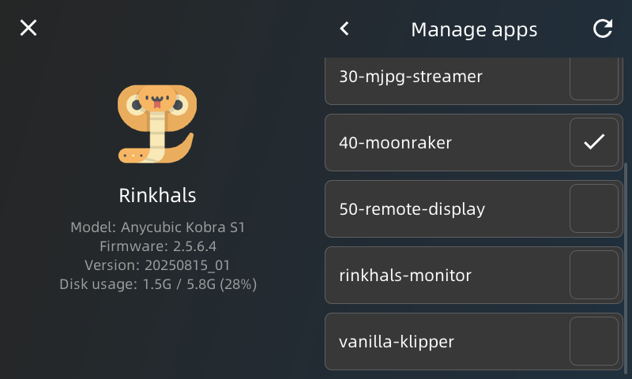
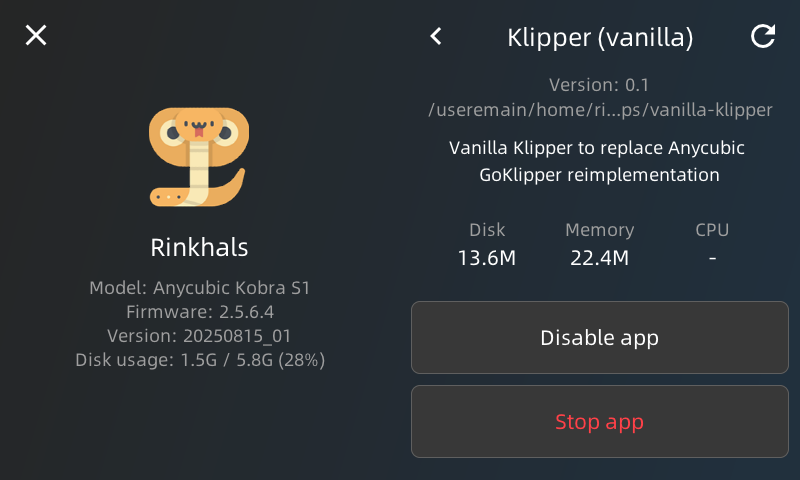
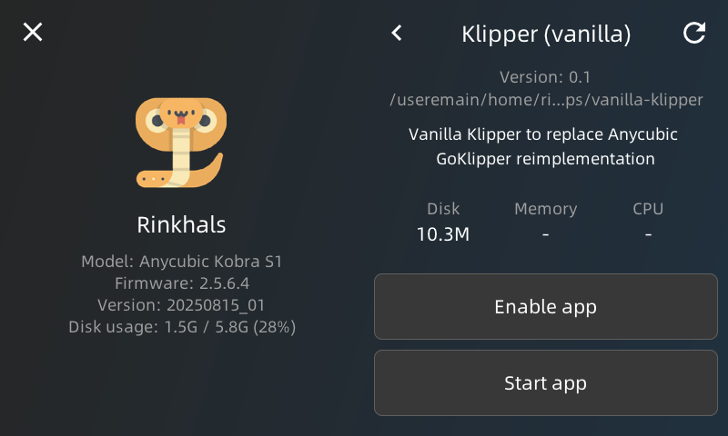

# Test builds of Vanilla Klipper APP for Rinkhals on Anycubic Kobra S1 

This readme explains how to install and enable the **vanilla Klipper (VK)** app on the Anycubic Kobra S1 running **Rinkhals**.

---

## 📋 Preconditions
- Anycubic Kobra S1 (**K1S**) with **Rinkhals** already installed and running.  
- Update file from release\KS1 foldern like e.g. `ks1_vanilla_klipper_app_v0.1_update.swu`

---

## 🚀 Installation Steps

1. **Prepare update file**
   - Rename  
     ```bash
     ks1_vanilla_klipper_app_v0.1_update.swu → update.swu
     ```
   - Copy it to your USB drive at the usual update location:
     ```
     aGVscF9zb3Nf/update.swu
     ```

2. **Plug USB drive into printer**
   - First beep → copying files starts  
   - Second beep → copying finished  
   - You may remove the USB stick after the second beep.

3. **Open Rinkhals App menu**  
   Navigate on the printer:  
   ```
   Settings → General → Rinkhals → Manage apps
   ```

     
     
   

   - You should now see **`vanilla-klipper`** in the list (without a checkmark).

---

## ⚙️ Starting Vanilla Klipper

You have two options:

### 1. Permanent (default at boot)
- Either enable the checkbox next to **`vanilla-klipper`** or in the vanilla-klipper settins itself
- Click **Enable App** → **Start App** 
- VK will now run every time the printer boots.  
  

### 2. Temporary (only for this session)
- Click on **`vanilla-klipper`** entry.  
- Press **Start App** (⚠️ do not press Enable App).  
- VK runs until reboot. After power-cycle, Rinkhals with GoKlipper will start again.  

Screenshots:  
  
  

---

## ⏳ First Startup Warning
The **first start** of VK takes longer since it compiles a module directly on the KS1.  

- Wait **at least 1 minute** after starting/enabling.  
- VK is ready once the **Mainsail page** is fully accessible and no longer shows "starting up" messages.

---

## 🗑️ Uninstall Vanilla Klipper
SSH into the printer as user:root password: rockchip and run:
```bash
cd /useremain/home/rinkhals/apps/
rm -rf vanilla-klipper/
```

---

## 🛠️ Configuration Notes

During installation, two config files are added to the standard config directory:
- `mainsail.cfg`
- `printer.klipper.cfg`

> You may delete these if not using VK.  
> VK uses **`printer.klipper.cfg`**, which is a **stripped-down version of GoKlipper’s `printer.cfg`**.

---

## ⚠️ Important G-code Warning

Just slicing with the **K1S profile in OrcaSlicer** and sending directly **will not work**.  
- You must provide a **proper startup G-code sequence** in your slicer.  
- Without it, you’ll get:
  ```
  Hotend too cold to extrude
  ```

Since GoKlipper is gone, so are its features (auto-leveling, wiping, reversed YX homing, startup macros).  
👉 You must provide your own homing and startup sequences in `printer.klipper.cfg`.

---
 