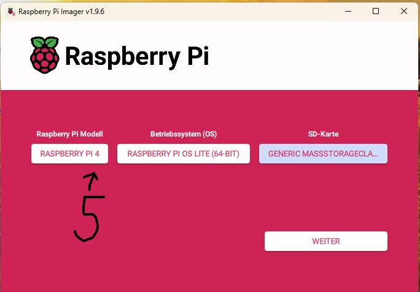
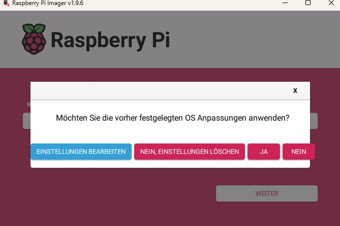
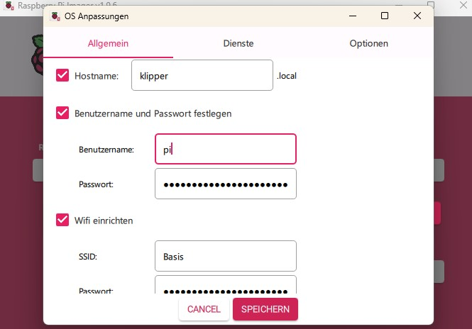
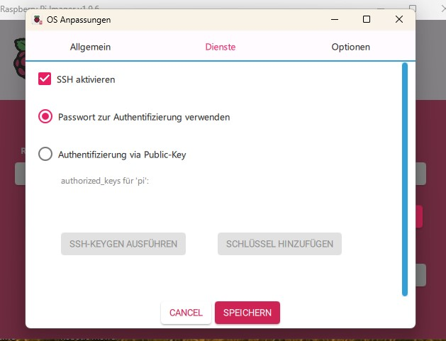
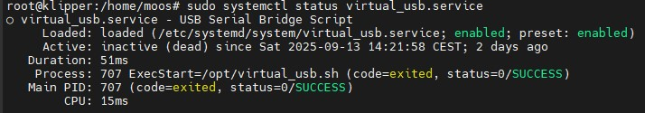

# 🥧 Raspberry Pi 4 & 5 — Setup Tutorial

This tutorial explains how to set up a Raspberry Pi 4 or 5 with Raspberry Pi OS Lite and prepare it as a USB Serial Bridge (e.g. for Klipper).

---

## 📑 Table of Contents

- [📦 Requirements](#-requirements)
- [🖼 Step 1 – Write Image](#-step-1--write-image)
- [⚙️ Step 2 – Configure Setup](#️-step-2--configure-setup)
- [🔐 Step 3 – Enable SSH](#-step-3--enable-ssh)
- [⚡ Step 4 – Boot the Pi](#-step-4--boot-the-pi)
- [⚡ Raspberry Pi 4 Setup](#-raspberry-pi-4-setup)
  - [2.1 config.txt](#21-configtxt)
  - [2.2 cmdline.txt](#22-cmdlinetxt)
  - [2.3 ports.sh](#23-portssh)
  - [2.4 ports.service](#24-portsservice)
- [⚡ Raspberry Pi 5 Setup](#-raspberry-pi-5-setup)
  - [2.1 config.txt](#21-configtxt-1)
  - [2.2 /etc/modules](#22-etcmodules)
  - [2.3 ports.sh](#23-portssh-1)
  - [2.4 ports.service](#24-portsservice-1)

---

## 📦 Requirements

- Raspberry Pi 4 or 5  
- SD card  
- Raspberry Pi Imager  

---

## 🖼 Step 1 – Write Image

Open the **Raspberry Pi Imager**:

  

Select your **Pi model**, the **operating system (Raspberry Pi OS Lite 64-bit)** and your **SD card**.

---

## ⚙️ Step 2 – Configure Setup



Enter your **hostname**, **username**, **password** and **Wi-Fi credentials**:



---

## 🔐 Step 3 – Enable SSH

Go to the **Services** tab and enable **SSH**:



Save the settings and write the image to the SD card.  
Your **SD card is now ready for the Pi**.

---

## ⚡ Step 4 – Boot the Pi

1. Insert the SD card into your Pi and power it on.  
2. Wait about **5 minutes** (or grab a coffee ☕).  
3. Start an SSH client on your PC and **connect to your Pi**.

---

---

# ⚡ Raspberry Pi 4 Setup

## 📝 2.1 config.txt

```bash
sudo su
nano /boot/firmware/config.txt
````

Replace the content with:

```
# For more options and information see http://rptl.io/configtxt

dtparam=spi=on
dtparam=audio=on

camera_auto_detect=1
display_auto_detect=1
auto_initramfs=1

dtoverlay=vc4-kms-v3d
max_framebuffers=2
disable_fw_kms_setup=1

arm_64bit=1
disable_overscan=1
arm_boost=1

[cm4]
# otg_mode=1

[cm5]
#dtoverlay=dwc2,dr_mode=host

[all]
dtoverlay=dwc2
modules-load=dwc2
enable_uart=1
```

> **Save:** `CTRL+O`, `Enter` — **Exit:** `CTRL+X`, `Enter`

---

## 📝 2.2 cmdline.txt

```bash
nano /boot/firmware/cmdline.txt
```

Add this **after `rootwait`**:

```
modules-load=dwc2,libcomposite
```

Example:

```
rootwait modules-load=dwc2,libcomposite cfg80211.ieee80211_regdom=DE
```

---

## ⚙️ 2.3 ports.sh

```bash
echo > /opt/ports.sh
nano /opt/ports.sh
```

Paste this content:

```bash
#!/bin/bash
modprobe libcomposite
cd /sys/kernel/config/usb_gadget/
mkdir -p klipper
cd klipper

echo 0x1d6b > idVendor
echo 0x0104 > idProduct
echo 0x0100 > bcdDevice
echo 0x0200 > bcdUSB

mkdir -p strings/0x409
echo "1234567890" > strings/0x409/serialnumber
echo "KlipperPi" > strings/0x409/manufacturer
echo "VirtualSerialBridge" > strings/0x409/product

mkdir -p configs/c.1/strings/0x409
echo "Config 1" > configs/c.1/strings/0x409/configuration

# First serial interface
mkdir functions/acm.usb0
ln -s functions/acm.usb0 configs/c.1/

# Second serial interface
mkdir functions/acm.usb1
ln -s functions/acm.usb1 configs/c.1/

# Bind to UDC
echo $(ls /sys/class/udc) > UDC
```

Make it executable:

```bash
chmod +x /opt/ports.sh
```

---

## ⚙️ 2.4 ports.service

```bash
echo > /etc/systemd/system/ports.service
nano /etc/systemd/system/ports.service
```

Content:

```
[Unit]
Description=USB Serial Bridge Script
After=network.target syslog.target

[Service]
Type=simple
ExecStart=/opt/ports.sh
User=root
WorkingDirectory=/opt
Restart=on-failure

[Install]
WantedBy=multi-user.target
```

Enable the service:

```bash
systemctl daemon-reload
systemctl start ports.service
systemctl enable ports.service
```

Check the status:

```bash
systemctl status ports.service
```



✅ Raspberry Pi 4 is now ready for Klipper → [Install Klipper](klipper_install.md)

---

---

# ⚡ Raspberry Pi 5 Setup

## 📝 2.1 config.txt

```bash
sudo su
nano /boot/firmware/config.txt
```

Content:

```
dtparam=audio=on

camera_auto_detect=1
display_auto_detect=1
auto_initramfs=1

dtoverlay=vc4-kms-v3d
max_framebuffers=2
disable_fw_kms_setup=1

arm_64bit=1
disable_overscan=1
arm_boost=1

[cm4]
otg_mode=1

[cm5]
dtoverlay=dwc2,dr_mode=host

[pi5]
dtoverlay=dwc2
```

---

## 📝 2.2 /etc/modules

```bash
echo > /etc/modules
nano /etc/modules
```

Add:

```
dwc2
libcomposite
```

---

## ⚙️ 2.3 ports.sh

```bash
echo > /opt/ports.sh
nano /opt/ports.sh
```

Content *(same as Pi 4)*
Then make it executable:

```bash
chmod +x /opt/ports.sh
```

---

## ⚙️ 2.4 ports.service

```bash
echo > /etc/systemd/system/ports.service
nano /etc/systemd/system/ports.service
```

Content:

```
[Unit]
Description=USB Serial Bridge Script
After=network.target syslog.target

[Service]
Type=simple
ExecStart=/opt/ports.sh
User=root
WorkingDirectory=/opt
Restart=on-failure

[Install]
WantedBy=multi-user.target
```

Enable the service:

```bash
systemctl daemon-reload
systemctl enable ports.service
systemctl start ports.service
```

Check the status:

```bash
systemctl status ports.service
```


✅ Raspberry Pi 5 is now ready for Klipper → [Install Klipper](klipperinstall.md)

```
