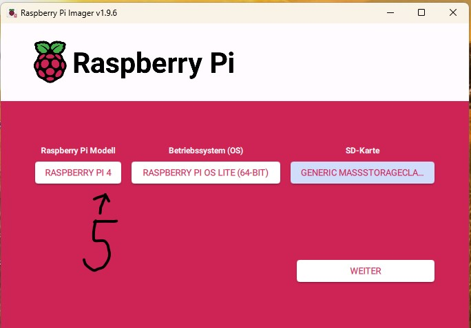
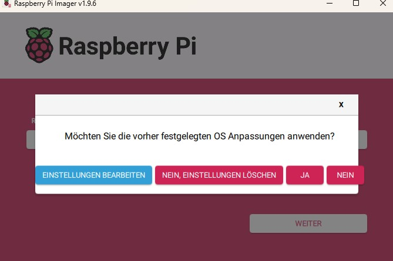
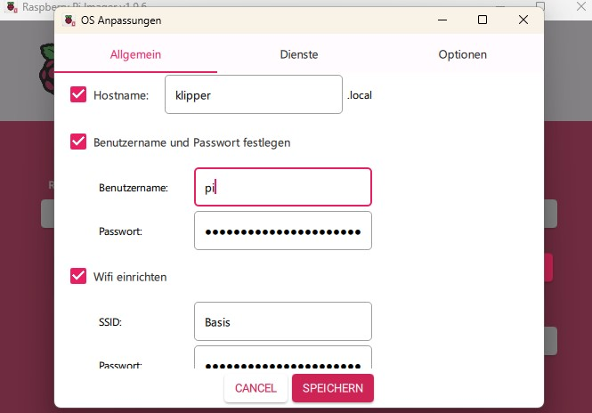
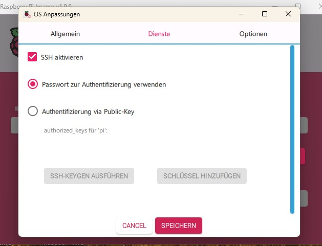

# 🥧 Raspberry Pi / Raspberry Pi Zero 2 W / BTT Pi2 — Setup Tunnel Tutorial

This tutorial explains how to set up a Raspberry Pi 4/5, Compute Module 4/5, Zero 2 W, or BTT Pi2 (BigTreeTech CB2) and prepare it as a USB Serial Bridge (e.g., for Klipper).

---

## 📑 Table of Contents

* [📦 Requirements](#-requirements)
* [🖼 Step 1 – Write Image](#-step-1--write-image)
* [⚙️ Step 2 – Configure Setup](#-step-2--configure-setup)
* [🔐 Step 3 – Enable SSH](#-step-3--enable-ssh)
* [⚡ Step 4 – Boot the Pi](#-step-4--boot-the-pi)
* [2️⃣ Copy the Installation Script](#2️⃣-copy-the-installation-script-to-your-pi)
* [3️⃣ Start SSH Connection](#3️⃣-start-your-ssh-connection)
* [4️⃣ Switch to Superuser Mode](#4️⃣-switch-to-superuser-mode)
* [5️⃣ Make the Script Executable](#5️⃣-make-the-script-executable)
* [6️⃣ Start the Installation](#6️⃣-start-the-installation)
* [7️⃣ Install KIAUH](#7️⃣-install-kiauh)
* [8️⃣ Modify Klipper Start Script](#8️⃣-modify-klipper-start-script)
* [✅ Done](#✅-done)

---

## 📦 Requirements

* Raspberry Pi 4, 5, Compute Module 4/5, or Zero 2 W (Raspberry Pi OS Lite 64-bit), or BTT Pi2 (Armbian)
* SD card
* Raspberry Pi Imager (for Raspberry Pi boards) or Armbian image tool of your choice (for BTT Pi2)

> ⚠️ **Raspberry Pi Zero 2 W note:** Zero 2 W is listed only because it supports OTG serial gadget mode. It is **not recommended** for Klipper workloads due to limited CPU and RAM.
>
> If you still use Zero 2 W, avoid running camera streaming (for example crowsnest) on the same device to reduce load and help prevent MCU communication errors during prints.

---

## 🖼 Step 1 – Write Image

Open the **Raspberry Pi Imager**:



Select your **Pi model**, the **operating system (Raspberry Pi OS Lite 64-bit)**, and your **SD card**.

For **BTT Pi2**, flash a current **Armbian Bookworm** image and boot it once.

Official BTT CB2 image releases:
- https://github.com/bigtreetech/CB2/releases

---

## ⚙️ Step 2 – Configure Setup



Enter your **hostname**, **username**, **password**, and **Wi-Fi credentials**:



---

## 🔐 Step 3 – Enable SSH

Go to the **Services** tab and enable **SSH**:



Save the settings and write the image to the SD card. Your **SD card is now ready for the Pi**.

---

## ⚡ Step 4 – Boot the Pi

1. Insert the SD card into your Pi and power it on.
2. Wait about **5 minutes** (or grab a coffee ☕).


---

## 5️⃣ Start Your SSH Connection

Use an SSH client (e.g. **PuTTY**, **MobaXterm**, or **Terminal**) to connect to your SBC:

```bash
ssh <USER>@<SBC-IP-ADDRESS>
```

---

## 6️⃣ Download and Run the Installation Script

Download and execute the **[`setup_tunnel_klipper.sh`](setup_tunnel_klipper.sh)** script directly on your SBC:

```bash
wget https://raw.githubusercontent.com/Kobra-S1/vanilla-klipper-swu/main/setup_tunnel_klipper.sh
chmod +x setup_tunnel_klipper.sh
sudo ./setup_tunnel_klipper.sh
```

The script now asks first:

* **1) Auto-detect**
* **2) Manual selection**

Manual selection currently supports:

* Raspberry Pi 4
* Raspberry Pi 5
* Raspberry Pi Compute Module 4 (CM4)
* Raspberry Pi Compute Module 5 (CM5)
* BTT Pi2 (BigTreeTech CB2)
* Raspberry Pi Zero 2 W

For **BTT Pi2**, the script configures `/boot/armbianEnv.txt` and may report that a reboot is required before `ports.service` can start.

If that happens, reboot once and run:

```bash
sudo systemctl restart ports.service
sudo systemctl status ports.service
```

Expected after successful setup: `Active: active (exited)`.

If startup fails (for example no UDC available yet), `ports.service` retries automatically with a short delay.

Ansible note: the Ansible setup in this repository is currently not updated for BTT Pi2 or Raspberry Pi Zero 2 W and supports only Raspberry Pi 4/5.

---

## 7️⃣ Install KIAUH

After the installation and execution of setup_tunnel_klipper.sh, **KIAUH** will automatically start.

Choose one of the following options:

* **Option 1** – to use KIAUH V6.
* **Option 3** – to use and save permanently KIAUH V6.

> ⚙️ Follow the instructions [Install Klipper](klipper_install.md)

---


## 8️⃣ Modify Klipper Start Script

To avoid spurious issues with klippy connecting to the S1 MCUs after reboot, add these two lines into your /etc/systemd/system/klipper.service file (above ExecStart=/home/pi/klippy-env/bin/python $KLIPPER_ARGS):
```
 ExecStartPre=/bin/stty -F /dev/ttyGS0 sane
 ExecStartPre=/bin/stty -F /dev/ttyGS1 sane
```
Afterwards execute:
```
 sudo systemctl daemon-reload
 sudo systemctl restart klipper
```

---


## ✅ Done!

Once the installation is complete, your **Klipper Tunnel** setup is ready.
You can now continue with your Klipper configuration and enjoy your automated setup.
