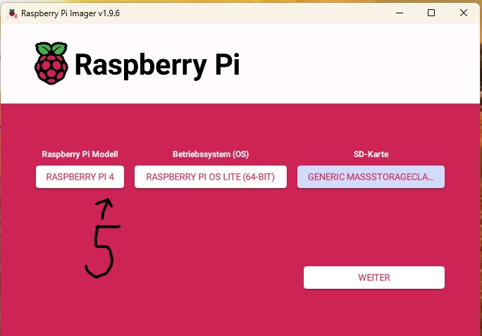

# 🥧 Raspberry Pi 4 & 5 — Setup Tunnel Tutorial

This tutorial explains how to set up a Raspberry Pi 4 or 5 with Raspberry Pi OS Lite and prepare it as a USB Serial Bridge (e.g., for Klipper).

---

## 📑 Table of Contents

* [📦 Requirements](#-requirements)
* [🖼 Step 1 – Write Image](#-step-1--write-image)
* [⚙️ Step 2 – Configure Setup](#-step-2--configure-setup)
* [🔐 Step 3 – Enable SSH](#-step-3--enable-ssh)
* [⚡ Step 4 – Boot the Pi](#-step-4--boot-the-pi)
* [2️⃣ Copy the Installation Script](#2️⃣-copy-the-installation-script-to-your-pi)
* [3️⃣ Start SSH Connection](#3️⃣-start-your-ssh-connection)
* [4️⃣ Switch to Superuser Mode](#4️⃣-switch-to-superuser-mode)
* [5️⃣ Make the Script Executable](#5️⃣-make-the-script-executable)
* [6️⃣ Start the Installation](#6️⃣-start-the-installation)
* [7️⃣ Install KIAUH](#7️⃣-install-kiauh)
* [✅ Done](#✅-done)

---

## 📦 Requirements

* Raspberry Pi 4 or 5
* SD card
* Raspberry Pi Imager

---

## 🖼 Step 1 – Write Image

Open the **Raspberry Pi Imager**:



Select your **Pi model**, the **operating system (Raspberry Pi OS Lite 64-bit)**, and your **SD card**.

---

## ⚙️ Step 2 – Configure Setup


Enter your **hostname**, **username**, **password**, and **Wi-Fi credentials**:


---

## 🔐 Step 3 – Enable SSH

Go to the **Services** tab and enable **SSH**:


Save the settings and write the image to the SD card.
Your **SD card is now ready for the Pi**.

---

## ⚡ Step 4 – Boot the Pi

1. Insert the SD card into your Pi and power it on.
2. Wait about **5 minutes** (or grab a coffee ☕).


---

## 2️⃣ Copy the Installation Script to Your Pi

Download the file **[`setup_tunnel_klipper.sh`](setup_tunnel_klipper.sh)** and copy it to your Raspberry Pi using **SCP**:

```bash
scp setup_tunnel_klipper.sh pi@<RPI-IP-ADDRESS>:~/
```

#### Example:

```bash
scp setup_tunnel_klipper.sh pi@192.168.1.42:~/
```

> 💡 **Tips:**
>
> * Replace `<RPI-IP-ADDRESS>` with your Raspberry Pi’s actual IP address.
> * The default username is usually **pi**.
> * You’ll be prompted for your Pi’s password.
> * Using `:~/` automatically places the file in your user’s home directory.

---

## 3️⃣ Start Your SSH Connection

Use an SSH client (e.g. **PuTTY**, **MobaXterm**, or **Terminal**) to connect to your Raspberry Pi:

```bash
ssh pi@<RPI-IP-ADDRESS>
```

---

## 4️⃣ Switch to Superuser Mode

Run the following command to get administrative privileges:

```bash
sudo su
```

---

## 5️⃣ Make the Script Executable

Grant execution permission to the script:

```bash
chmod +x setup_tunnel_klipper.sh
```

---

## 6️⃣ Start the Installation

Run the setup script and follow the on-screen instructions:

```bash
./setup_tunnel_klipper.sh
```

> 🧩 When prompted, **select your Raspberry Pi version (4 or 5)** and press **Enter**.

---

## 7️⃣ Install KIAUH

After the installation, **KIAUH** will automatically start.

Choose one of the following options:

* **Option 1** – to use KIAUH V6
* **Option 3** – to use and save permanently KIAUH V6

> ⚙️ Follow the instructions [Install Klipper](klipper_install.md)

---

## ✅ Done!

Once the installation is complete, your **Klipper Tunnel** setup is ready.
You can now continue with your Klipper configuration and enjoy your automated setup.
