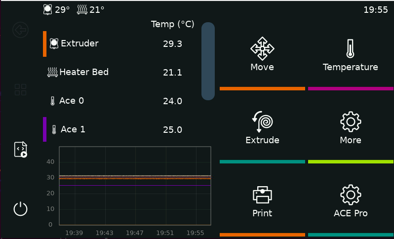

# KlipperScreen Viewer

Standalone Rinkhals app that displays a remote KlipperScreen VNC session on the
printer touchscreen and forwards touch input back to the VNC server.



This app ships its own `fb-vnc-viewer` binary and can be installed on an
existing Rinkhals system.

WARNING: Only KS1 and K3 was tested. Support for other printers is still experimental and may not work correctly yet.

Package mapping:
- `update-k2p-k3.swu`: K2P, K3, K3V2
- `update-ks1.swu`: KS1, KS1M
- `update-k3m.swu`: K3M

## App Configuration

Edit this file on the printer:

```bash
/useremain/rinkhals/klipperscreen-viewer.conf
```

At minimum, set the VNC server IP or hostname:

```bash
VNC_HOST=<rpi-ip-or-hostname>
```

Most installations should leave the model-specific settings empty. The app
auto-detects the printer model and applies the correct defaults for rotation
and touch handling. Only override those values if you know you need to.

## Raspberry Pi Setup

This assumes KlipperScreen is already installed on the Raspberry Pi. If not,
install it first, for example with KIAUH.

If you also use the ACE Pro KlipperScreen integration, update that too before
testing this viewer so the layout matches the printer screen better.

Download the setup script to the Raspberry Pi, make it executable, and run it
with the matching printer profile. Example for KS1:

```bash
wget -O rpi-setup.sh https://raw.githubusercontent.com/Kobra-S1/vanilla-klipper-swu/main/klipperscreen-viewer-app/rpi-setup.sh
chmod +x rpi-setup.sh
sudo ./rpi-setup.sh --profile ks1
```

Example profiles:
- `ks1`
- `ks1m`
- `k3`
- `k3v2`
- `k2p`
- `k3m`

This installs the required VNC server and creates a dedicated
`klipperscreen-vnc` systemd service on the Pi.

If you later change KlipperScreen itself, restart that Pi-side service so the
changes take effect.

## Install On Printer

Install the correct SWU from USB as `update.swu` on the printer.

After installation, update the app config on the printer so the viewer knows
where to connect:

```bash
/useremain/rinkhals/klipperscreen-viewer.conf
```

At minimum:

```bash
VNC_HOST=<rpi-ip-or-hostname>
```

Then start or enable the app from the Rinkhals Apps UI, or run:

```bash
/useremain/home/rinkhals/apps/klipperscreen-viewer/app.sh start
```

## Stop

To stop the app and return to the normal printer UI:

- run `/useremain/home/rinkhals/apps/klipperscreen-viewer/app.sh stop` over SSH
- or touch and hold the top-left corner of the KlipperScreen view for more than 5 seconds
