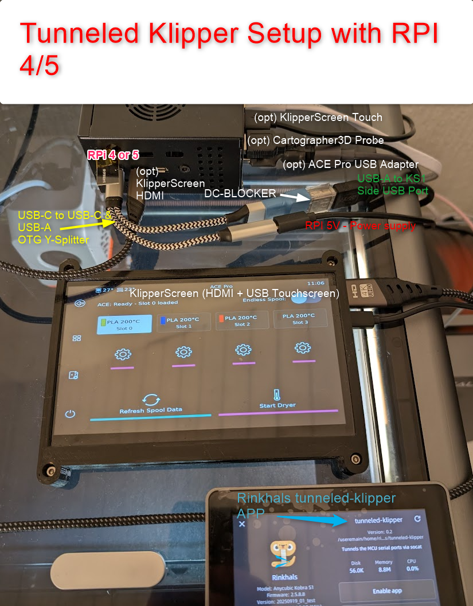

# Tunneled-Klipper App for Rinkhals on Anycubic Kobra S1 / Kobra 3

The **tunneled-klipper** app forwards the printer's MCUs serial interface connections to an SBC which supports OTG USB serial  gadget mode (like Raspberry Pi 4 / 5 / Zero W2).
This lets you run Klipper on the RPi4 while the tunneled-klipper APP (running on the Kobra printers SoC, hosted by Rinkhals) acts as a serial bridge to the MCUs.

Overview of the general setup:

<p align="center">
  
</p>

Additional Required Hardware:
- RPI 4 / 5 or any other SBC with serial gadget OTG support (installation describes only RPI setup)
- USB-A to USB-A cable to connect RPI with Kobra printer via OTG adapter
- USB-A DC-DC Blocker to prevent backpowering of the printer via the USB-A connection by the RPI
- OTG USB-C to USB-C+USB-A "Y" Adapter (buy a quality one which is capable of providing 5A for the RPI; simple ones often limit to max 3A). Alternative: Power RPI via 5V GPIO pin, connect USB-C port via USB cable directly (via the DC-DC blocker to avoid back-powering) to the printer.

- Optional: For ACE Pro connection ONE USB to ACE Pro 4-pin connector adapter is necessary (you have to build your own, see ACE Pro driver repo: https://github.com/Kobra-S1/ACEPRO/tree/dev). You only need one adapter, even if multiple ACE Pro units need to be connected, as each ACE Pro is connected in a daisy-chain style to each other, so only the first ACE Pro in the chain needs to be connected to the RPi.
---

## ⚠️ Important Warning

- Note for KS1: Better **NOT** click **Enable App** in Rinkhals, unless you are fine to use SSH to disable the app when needed.  
- At first try out, only use **Start App**. Otherwise the printer config menu may not be reachable anymore; you'll need SSH or an `installer.swu` to recover and disable the app. If you like, you can always later on come back and use **Enable App** to switch on automatic start.

---

## 🛠️ Requirements

- SBC with OTG Serial Gadgetmode support. Scripts are tested on Raspberry Pi 4 (RPi4) and RPI5.
- USB-C to USB-A OTG cable with an additional USB power blocker  
- Additional USB serial-gadget setup & vanilla-Klipper installation on the RPi4 (not covered here)
- Installation of klipper ACEPro driver (with optional Klipperscreen support) if you want to use the ACE-Pro (https://github.com/Kobra-S1/ACEPRO/tree/dev)

For details, you can find some information in the **#tunneled-klipper** channel on the Rinkhals Discord.
But most helpful will be the two installation helper scripts, which you can find here:

A bash script-based installation:
  - [Raspberry Setup for Tunnel](SetupRaspberryPiTunnel.md)

or as an alternative:

An Ansible-based installation:
- [configure-tunneled-raspberry-pi](ansible/configure-tunneled-raspberry-pi/)

Example setup for Kobra-S1:



 
---

## 🔄 Use Case

Choose tunneled-klipper if:

- You prefer running Klipper on an external RPi4 (to avoid the CPU/memory limitations of the Kobra SoC).  
- You want features not supported by the SoC build (e.g., LIS2DW12 resonance testing, adaptive bedmesh leveling, using more than two ACE-Pros).

Otherwise, using [vanilla-klipper](vanilla-klipper.md) directly on the SoC is an easier to install option.

---

## 📋 Preconditions

- Anycubic Kobra S1 (**KS1**) or K3 with **Rinkhals** already installed and running. This how-to only mentions KS1; for K3, look for the same files but with K3 naming.
- Update file from **[Releases folder](releases/)**. Current release:
  ```
  app-tunneled-klipper-ks1.swu
  ```

---

## 🚀 Installation Steps

1. **Prepare the update file**
   ```bash
   app-tunneled-klipper-ks1.swu → update.swu
   ```
   Create a folder named 'aGVscF9zb3Nf' in the root of your FAT32 formated USB drive, then copy the SWU file into it:
   ```
   aGVscF9zb3Nf/update.swu
   ```

2. **Insert the USB drive into the printer**
   - 1st beep → Printer has recognized that there is SWU file and starts checking if it has the right format
   - 2nd beep → SWU file was accepted and the Rinkhals APP installer has finished its job

3. **Open the Rinkhals App Menu**
   ```
   Settings → General → Rinkhals → Manage apps
   ```
   You should now see **tunneled-klipper** listed.

---

## ⚙️ Starting Tunneled-Klipper

### Do **not** enable at boot (for now)

- Do **not** tick the checkbox next to **tunneled-klipper**.  
- Do **not** press **Enable App**.  
- If enabled, the app will auto-start at boot, but switching to the **Settings** tab can lead to “Printer not ready…” and a blocked UI.  
  To unblock the UI via SSH on the Kobra S1:
  ```bash
  cd /useremain/home/rinkhals/apps/tunneled-klipper/
  ./app.sh stop
  ```

_Screenshots:_  
  


### Start/stop the app manually

- Open the **tunneled-klipper** entry by tapping its name.  
- Press **Start App** to start it (⚠️ do **not** press **Enable App**).  
  A double-beep confirms the app has started; another two beeps also occur if the RPi is already connected and serial ports are detected.
- Use the same button to stop/restart GoKlipper as needed.

### RPi4 setup

- Install Klipper on the RPi4 as usual, by using this forked Klipper branch: https://github.com/Kobra-S1/klipper-kobra-s1/tree/Kobra-S1-Dev  
  **IMPORTANT:** Check out the "dev" branch, don't use 'main' (which is just the currently used base for the Kobra-S1 patches)

- Create your Klipper `printer.cfg` on the RPi4:
  - Start from your existing config; comment out unsupported keys.  
  - Change `/dev/ttyS3` and `/dev/ttyS5` to the serial-gadget devices (likely `/dev/ttyGS0` and `/dev/ttyGS1`).  
  - Or use the ready-to-use KS1 named config files from the latest release 'config' folder: **[releases](releases)**  
    (You need all files with 'generic' in their name as well as all named 'KS1' or 'K3', depending on which printer you use)

- Open Mainsail in your browser.  
- Click **MCU Restart** if the connection isn’t established automatically at startup.

**Webcam from KS1 in Mainsail**

In Mainsail, click the gear icon (top-right) → scroll to **Webcams** → **ADD WEBCAM**. Add two streams, replacing `YourPrinterName` with the hostname or IP of your KS1:

- Stream URL: `http://<YourPrinterName>:8080/?action=stream`  
- Snapshot URL: `http://<YourPrinterName>:8080/?action=snapshot`

---

## ⚠️ Functional Notes
- To avoid spurious issues with klippy connecting to the S1 MCUs after reboot, add these two lines into your `/etc/systemd/system/klipper.service` file (above `ExecStart=/home/pi/klippy-env/bin/python $KLIPPER_ARGS`):
```
 ExecStartPre=/bin/stty -F /dev/ttyGS0 sane
 ExecStartPre=/bin/stty -F /dev/ttyGS1 sane
```
Afterwards execute:
```
 sudo systemctl daemon-reload
 sudo systemctl restart klipper
```
- To allow full MCU reconfiguration via the tunneled vanilla-Klipper, MCUs are reset at every start/stop. This causes the LED light to flicker. (Without this, changes—e.g., nozzle sensitivity—wouldn’t be possible.)

- When the app starts, it waits for two RPi serial-gadgets to appear and then uses the Linux-assigned serial-port names for the `socat` tunnels. This name detection avoids collisions with ACE-PRO-assigned `/dev/ttyACMx` names.

- RPi detection relies on the RPi gadget USB ID (tested on RPi4&RPi5  so far; other RPis may require further testing).

- The RPi can already be connected when you start the app, but you can also start it first and connect later.  
  Disconnecting/reconnecting USB while the tunneled app is running is supported. If a `socat` connection breaks due to USB interruption, the MCUs are reset; use **FIRMWARE RESTART** in Mainsail to re-establish the connection.

- Sometimes the MCU connection after first boot cannot be properly established and even FIRMWARE RESTART alone does not fix it. In this case a hard MCU reset is necessary. The quickest way to do that is to remove the USB plug from the printer, wait until you hear two USB disconnect beeper-jingles after 1-2 seconds, then replug, wait for two more confirmation jingles and then try FIRMWARE RESTART again.

---

## 🔊 Sound Indications

- At app startup, a short **double beep** indicates the delayed app launcher has begun (the “real” app starts ~15s later to avoid boot-time CPU issues).  
- Then you’ll hear the **normal double beep** from GoKlipper.  
- A **three-tone beep** indicates the “real” tunneled-Klipper app has started.  
- If an RPi is already connected at startup, you’ll immediately hear **two short double beeps**, each indicating a serial-gadget was detected and a `socat` tunnel launched.  
- If USB is **disconnected** while printing, the MCUs reset and a **two-tone beep** plays when the `socat` tunnels are removed.  
- If USB is **reconnected**, another **two-tone beep** indicates the `socat` tunnels have restarted.
