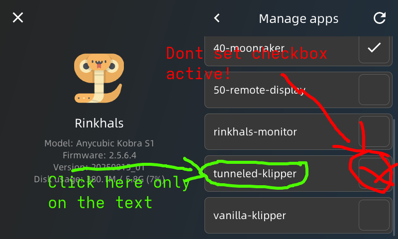
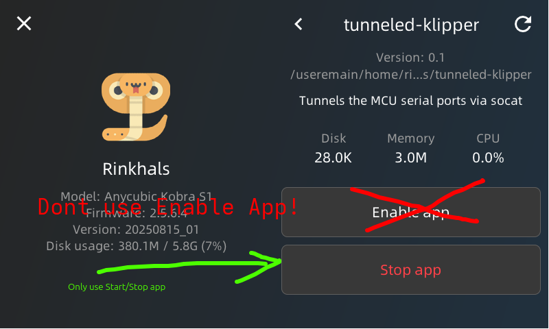

# Tunneled-Klipper App for Rinkhals on Anycubic Kobra S1

The tunneled-klipper app forwards the printer’s serial interface to a Raspberry Pi 4 via USB gadget mode.  
This allows running Klipper on the RPi4 while the Kobra S1 acts as a serial bridge.

---

## ⚠️ Important Warning

- Do **NOT** click **Enable App** in Rinkhals.  
- Only use **Start App** (otherwise the printer may beep continuously and show error codes and you need ssh or installer.swu to recover from and disable the app).  

---

## 🛠️ Requirements

- Raspberry Pi 4 (RPi4)  
- USB-C to USB-A OTG Cable with additional usb-power blocker
- Additional usb serial-gadget setup & vanilla-klipper installation on the RPi4 (not covered here)  

For details, see **#tunneled-klipper** channel on the Rinkhals Discord.

---

## 🔄 Use Case

Choose tunneled-klipper if:

- You prefer running Klipper on an external RPi4 (more CPU/memory).  
- You want to use features not supported by the SoC build (e.g., LIS2DW12 resonance testing).  

Otherwise, use [vanilla-klipper](vanilla-klipper.md) directly on the SoC.

---

## 📋 Preconditions

- Anycubic Kobra S1 (**K1S**) with **Rinkhals** already installed and running.  
- Update file from `releases/KS1/`, e.g.  
  ```
  ks1_tunneled-klipper_app_v0.2.swu
  ```

---

## 🚀 Installation Steps

1. **Prepare update file**
   ```bash
   ks1_tunneled-klipper_app_v0.2.swu → update.swu
   ```
   Copy it to:
   ```
   aGVscF9zb3Nf/update.swu
   ```

2. **Insert USB drive into printer**
   - 1st beep → copying starts  
   - 2nd beep → copying finished  

3. **Open Rinkhals App Menu**
   ```
   Settings → General → Rinkhals → Manage apps
   ```
   You should now see **`tunneled-klipper`** listed.

---

## ⚙️ Starting Tunneled Klipper

### Only enable the App temporary
- Avoid for now enabling checkbox next to **tunneled-klipper**
- Avoid also to press **Enable App**  
- App will run automatically at boot, but changing to settings tab ends up in "Printer not ready..." and UI is blocked.
  (You can unblock UI manually by ssh into Kobra-S1, execute "cd /useremain/home/rinkhals/apps/tunneled-klipper/" and afterwards "./app.sh stop")

Screenshots:  
Screenshots:  

### Instead start/stop app manually
- Open **tunneled-klipper** entry by pressing on the **tunneled-klipper** text
- Press **Start App** (⚠️ Do not press Enable App) to start or stop to re-start goklipper

### RPI4
- Install klipper as usual on a RPI

- Create your own printer.cfg file for klipper on RPI, by either using your own as base and comment out unsuported keys and change the /dev/ttyS3 and /dev/ttyS5 to the serial-gadget ones (possibly called /dev/ttyGS0 and GS1) or use this KS1 printer cfg as a starting point:  → [**printer.tunneled-klipper.cfg**](releases/KS1/printer.tunneled-klipper.cfg)  

- Open up mainsail page in a browser
- Press "MCU Restart" if connection is not established automatically at startup

- To get webcam image from KS1, click on gear icon in right top corner, scroll down to "Webcams", click "ADD WEBCAM" and add the two streams, replace "YourPrinterName" with the name or ip of your KS1 printer:
URL Stream: http://YourPrinterName/webcam/?action=stream
URL Snapshot: http://YourPrinterName/webcam/?action=snapshot
---

## ⚠️ Functional notes

- To allow full reconfiguration of MCU via tunnel vanilla-klipper, MCUs are reseted at every start/stop -> Causes flickering of LED light (Without that, it would be not possible to change e.g. nozzle sensitivity or stuff like that).

- If app is started, it waits for two RPI Serial Gadgets to appear and uses then linux assigned serial port names for the socat tunnel.
This name detection is necessary to avoid name collision with ACE-PRO assigned /dev/ttyACMx names.

- The RPI detection works via detecting the RPI4 gadget USB ID (only tested yet with my RPI4, may fail with other RPIs, needs to be further tested)

- RPI4 can be already connected when APP is started manually, but its also possible to start it without and connect later.
  But avoid disonnecting it during APP is running, requires othervise restart of the app.
