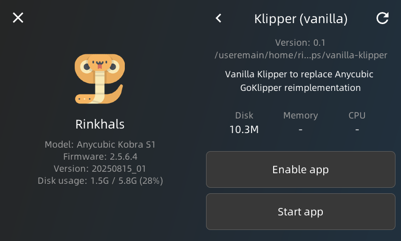

# Vanilla Klipper App for Rinkhals on Anycubic Kobra S1, Kobra 3 / Kobra 3v2 with ACE-Pro Multicolor support
<p align="center">
  
</p>

This README explains how to install and enable the **vanilla Klipper (VK)** app on the Anycubic Kobra S1 or K3 running **Rinkhals**.

---

## ❗ IMPORTANT NOTICE
- Some hardware features do **not work** with VK, e.g. filament movement sensor for tangle detection
- Some features work **only when using tunneled-klipper with an RPi4** (e.g., LIS2DW12 resonance testing due to lack of required python packages in Rinkhals provided environment).  
- For the app running directly on the printer Host: It's mostly accessible only via the **Mainsail web interface** (only very limited functionality usable via Anycubics UI on the printer display).  
- I recommend using a non-test Rinkhals version for initial installation, as with the latest changes in Rinkhals some changes broke the proper integration with VK (e.g. sending/starting a print fails).

---

## 📋 Preconditions

- Anycubic Kobra S1 (**KS1**) or K3 with **Rinkhals** already installed and running
- Update file from **[Releases folder](releases/)**
  ```
  app-vanilla-klipper-ks1.swu
  ```
  This documentation explains the installation based on KS1, for K3 look for the corresponding file or directory with K3 in its name.

## ⚠️ WARNING
- The vanilla-klipper app built on the official Rinkhals GitHub currently does not work properly ("Error 22" can be shown on the printers display at startup), hence use the ones from this GitHub here until that is fixed. If you get this error, use rinkhals installer.swu to uninstall rinkhals fully (will also uninstall the APPs).
After re-installing rinkhals, delete via mainsail "printer.klipper.cfg" if its still there from previous installation try. Then re-try APP installation with the SWU from this repo here.

Also: Use for now the last release Rinkhals (not test version). Currently (end of December 2025) the test version includes moonraker changes which break the ability to upload GCode files to vanilla-klipper or does not start the print with them (can't open gcode file error).

---

## 🚀 Installation Steps

1. **Prepare the update file**
   ```bash
   app-vanilla-klipper-ks1.swu → update.swu
   ```
   Copy it to:
   ```
   aGVscF9zb3Nf/update.swu
   ```

2. **Insert the USB drive into the printer**
   - 1st beep → copying starts  
   - 2nd beep → copying finished  

2.1 **`printer.cfg` handling**
   - On **first install**, `printer.klipper.cfg` and other helper configuration files are installed automatically.  
   - On **reinstall/update**, Rinkhals **does not** overwrite your existing configuration files.  
     Compare the latest reference and update manually if needed. The corresponding configuration files are in the 'config' folder of each version → **[releases](releases/)**. Use it if in doubt after updating to the latest `app-vanilla-klipper-ks1.swu`.

3. **Open the Rinkhals App Menu**
   ```
   Settings → General → Rinkhals → Manage apps
   ```
   You should now see **vanilla-klipper** listed.

---

## ⚙️ Starting Vanilla Klipper

### Option 1: Permanent (autostart at boot)
- Enable the checkbox next to **vanilla-klipper**.  
- Press **Enable App → Start App**.  
- The app will run automatically on every boot.

### Option 2: Temporary (until reboot)
- Open the **vanilla-klipper** entry.  
- Press **Start App** (⚠️ Do **not** press **Enable App**).  

_Screenshots:_  


---

## ⏳ First Startup

- On the first launch, a helper library is compiled — this takes **about 1 minute**.  
- VK is ready once Mainsail is fully accessible without “starting up” messages.
- Not all UI elements on the display will work now, however some still do, as they are "compatible enough" with vanilla-klipper.

So you can still initiate via display:

- Hotend PID tuning
- Hotbed PID tuning
- Homing
- Observe hotend / bed temperatures

Note: ACE Pro panels won't work properly though (even if they still show, now outdated, spool data), as now the ACEPRO driver is needed to communicate to the ACEPro(s)

Resonance calibration is not possible due to missing numpy module on the printer. You can though re-use the value you measured under go-klipper, by extracting the measured resonance values from mutable configuration file on the printer and transfer the measured values for vanilla-klipper in the printer.klipper.cfg file.
---

## ⏳ ACE Pro Support
To enable support for multi-color/multi material ACE-Pro unit, make sure the ACE Pro(s) are connected to the printer (same setup as with stock firmware).
Then open the **ace_ks1.cfg** file on your printer (or the **ace_k3.cfg** for Kobra 3 printers), and check in the [ace] section if the 'ace_count' number matches the number of connected ACE-Pro units.
Default is set to one ACE:

```
[ace]
ace_count: 1
baud: 115200
```

There is no 'soft' limit for the number of ACE Pro units to use (stock firmware limits to two units max), so you can also use e.g. 3 or 4 here to enable 12 or 16 color printing (you need to come up with a matching 12-in-1 or 16-in-1 filament hub though to connect so many PTFE tubes to the printer).


To finally let klipper use the ace driver, locate in the **printer.cfg** file the commented out ace include and enable it (remove the #):
```
[include ace_KS1.cfg]
```
and finally restart klipper.

Verify that ACE is recognized by the ACE driver. At startup or ACE reconnect, you should see log output of the COM-Port autodetection in Mainsail, similar to this:
```
Try connecting to /dev/ttyACM0
[1] /dev/ttyACM1 at 2-2.4.3
[0] /dev/ttyACM0 at 2-2.3 <- SELECTED
ACE[0] USB enumeration order:
ACE[0] USB device found: /dev/ttyACM0 at location '2-2.3'
ACE[0] USB device found: /dev/ttyACM1 at location '2-2.4.3'
```
For each connected ACE a version information will also be shown like e.g. this:
```
ACE[0]: {'id': 1, 'code': 0, 'result': {'id': 1, 'slots': 4, 'model': 'Anycubic Color Engine Pro', 'firmware': 'V1.3.863', 'boot_firmware': 'V1.0.1', 'structure_version': '0'}, 'msg': 'success'}
```


With VK running on SoC there is currently no way to configure the spools, etc. via display, so console commands must be used to control and configure the ACE-Pro:
```
ACE_GET_STATUS: Query ACE status. INSTANCE= or TOOL=
ACE_RECONNECT: Reconnect ACE serial. INSTANCE=
ACE_GET_CURRENT_INDEX: Query currently loaded tool index
ACE_FEED: Feed filament. T= or INSTANCE= INDEX=, LENGTH=, [SPEED=]
ACE_STOP_FEED: Stop feeding. T= or INSTANCE= INDEX=
ACE_RETRACT: Retract filament. T= or INSTANCE= INDEX=, LENGTH=, [SPEED=]
ACE_STOP_RETRACT: Stop retraction. T= or INSTANCE= INDEX=
ACE_SMART_UNLOAD: Unload filament, tries also other filament slots if sensor still triggers after unload of current tool [TOOL=]
ACE_SMART_LOAD: Load all non-empty slots to verification sensor.
ACE_SET_SLOT: Set slot: T= or INSTANCE= INDEX=, COLOR=R,G,B MATERIAL= TEMP= or EMPTY=1
ACE_SAVE_INVENTORY: Save inventory. INSTANCE=
ACE_START_DRYING: Start dryer. [INSTANCE=] TEMP= [DURATION=240]
ACE_STOP_DRYING: Stop dryer. [INSTANCE=]
ACE_ENABLE_FEED_ASSIST: Enable feed assist. T= or INSTANCE= INDEX=
ACE_DISABLE_FEED_ASSIST: Disable feed assist. T= or INSTANCE= INDEX=
ACE_SET_PURGE_AMOUNT: Set purge parameters. PURGELENGTH= PURGESPEED= [INSTANCE=]
ACE_QUERY_SLOTS: Query slots. INSTANCE= (omit to query all)
ACE_ENABLE_ENDLESS_SPOOL: Enable endless spool
ACE_DISABLE_ENDLESS_SPOOL: Disable endless spool
ACE_ENDLESS_SPOOL_STATUS: Query endless spool status.
ACE_ENABLE_RFID_SYNC: Enable RFID inventory sync. [INSTANCE=] optional
ACE_DISABLE_RFID_SYNC: Disable RFID inventory sync. [INSTANCE=] optional
ACE_DEBUG: Send debug request to device. INSTANCE= METHOD= [PARAMS=]
ACE_DEBUG_SENSORS: Print all sensor states (toolhead, RMS, path-free)
ACE_DEBUG_STATE: Print manager and instance state information
ACE_RESET_PERSISTENT_INVENTORY: Reset inventory to empty. INSTANCE=
ACE_RESET_ACTIVE_TOOLHEAD: Reset active toolhead state. INSTANCE=
ACE_RFID_SYNC_STATUS: Query RFID sync status. [INSTANCE=]
ACE_SET_ENDLESS_SPOOL_MODE: Set endless spool match mode. MODE=exact|material
ACE_GET_ENDLESS_SPOOL_MODE: Query current match mode
ACE_CHANGE_TOOL: Change tool or unload. TOOL= or TOOL=-1
ACE_SET_RETRACT_SPEED: Command to update retract speed. T= or INSTANCE= INDEX=, SPEED=
ACE_SET_FEED_SPEED: Command to update feed speed. T= or INSTANCE= INDEX=, SPEED=
ACE_FULL_UNLOAD: Full unload until slot empty. TOOL= or TOOL=ALL or [no TOOL=current]
ACE_SHOW_INSTANCE_CONFIG: Show resolved config for ACE instance(s). [INSTANCE=]
```
---

## 🗑️ Uninstall

```bash
ssh root@<printer-ip>  # password: rockchip
cd /useremain/home/rinkhals/apps/
rm -rf vanilla-klipper/
```

---

## 🛠️ Configuration Notes

Installed config files:
- `mainsail.cfg`
- `printer.klipper.cfg` (VK uses a printer.cfg based on some parts of GoKlipper’s original printer.cfg`)
- `printer_generic_macros.cfg` Not printer dependent helper macros used for KS1 as also K3
- `ace_macros.cfg` Not printer dependent helper macros for ACE Pro support (used for KS1 as also K3)
- `ace_KS1.cfg` or `ace_K3.cfg` printer dependent configuration for ACE Pro support

👉 These files are only installed if they do not already exist on the printer (re-install case)!
So if you perform a VK APP update, your config files will not get overwritten. If you want to get the full update, delete manually the above config files before re-installing.

👉 You may delete these if not needed after uninstall and clean up any evidence that you installed VK on your printer!  
Also delete the 'saved_variables.cfg' to have all files installed & created at runtime removed.

---

## ⚠️ Functional Notes

- To allow full MCU reconfiguration via vanilla-Klipper, the MCUs are **reset at every start/stop**, which causes the LED light to flicker. (Without this, changes such as nozzle sensitivity would not be possible.)

---

## 🧾 Release Notes
**Latest builds are now organized in release date named folders, those builds include:**  
- ACE Pro support
- Introduced additional Macros (e.g. PRINT_END, LOAD_FILAMENT, etc.) and can be found here: **[Releases folder](releases/)**

Older build: **[Previous Releases folder](releases/previous_releases)**

**Builds ≥ v0.3**  
It’s possible to print directly with **OrcaSlicer** / **Anycubic Next** sliced G-code — no additional startup G-code modifications in the slicer are necessary.

**Builds ≤ v0.2**  
- The OrcaSlicer KS1 profile alone will **not work**.  
- You must add proper startup G-code; otherwise you’ll see:
  ```
  Hotend too cold to extrude
  ```
  Use this as a starting point (only for older builds ≤ v0.2):  
  Startup help: → **[KS1_WIP_StartupGCode.txt](releases/previous_releases/KS1_WIP_StartupGCode.txt)**  
  End G-code: → **[KS1_WIP_EndGCode.txt](releases/previous_releases/KS1_WIP_EndGCode.txt)**  
  Copy & paste into your slicer’s Startup/End G-code sections as appropriate.